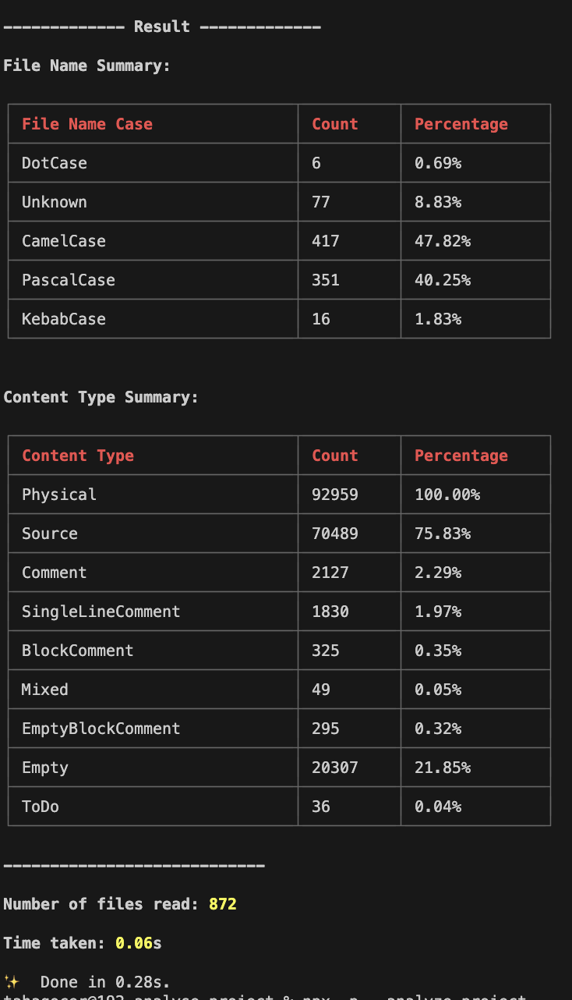

# Codebase Analyzer

Codebase Analyzer is a command-line tool that analyzes a specified directory and provides summary information about the code files it contains. It can help you gain insights into your codebase's structure, naming conventions, and content types.




## Features

- Analyzes the specified directory recursively
- Provides summary information about file name cases and content types
- Supports filtering by file extensions and excluding specific directories/files
- Customizable through command-line options

## Installation

You can install Codebase Analyzer globally using NPM:

```bash
npm install -g analyze-codebase 
```

or use with npx

```bash
npx analyze-codebase ./MyProject --exclude node_modules dist --extensions .tsx .ts
```

## Usage

To analyze a directory, use the analyze command followed by the directory path. Here's an example:

```bash
analyze-codebase ./MyProject --exclude node_modules dist --extensions .tsx .ts
```

## Options

- -f, --framework <framework>: Specify the framework used in the codebase.
- -e, --extensions <extensions...>: Specify the file extensions to include in the analysis. You can provide multiple extensions separated by spaces. Example: -e .js .ts.

- -e, --exclude <exclude...>: Specify directories or files to exclude from the analysis. You can provide multiple paths separated by spaces. Example: -e node_modules dist.

- --checkFileNames [checkFileNames]: Check file names. Default: true.

- --checkFileContent [checkFileContent]: Check file content. Default: true.

## Examples

Analyze a directory with default options:

```bash
analyze-codebase ./src
```

Analyze a directory with a specified framework and file extensions:

```bash
analyze-codebase ./src -f react --extensions .js .jsx .ts .tsx
```

Exclude specific directories from the analysis:

```bash
analyze-codebase ./src --exclude node_modules dist
```

Analyze only file names

```bash
analyze-codebase ./src --exclude node_modules dist --checkFileContent=false
```

Analyze only file content

```bash
analyze-codebase ./src --exclude node_modules dist --checkFileNames=false
```

## Contribution

We welcome contributions to enhance the functionality and features of Codebase Analyzer. To contribute to the project, please follow these steps:

Fork the repository by clicking on the "Fork" button at the top right corner of this page.

Clone the forked repository to your local machine:

```bash
git clone https://github.com/your-username/analyze-codebase.git
```

Create a new branch for your feature or bug fix:

```bash
git checkout -b feature/your-feature-name
```

or 


```bash
git checkout -b bugfix/your-bug-fix
```

Make your modifications and additions to the codebase.

Test your changes thoroughly to ensure they do not introduce any issues.

Commit your changes with a descriptive commit message:

```bash
git commit -m "Add your commit message here"
```

Push your changes to your forked repository:

```bash
git push origin feature/your-feature-name
```
or

```bash
git push origin bugfix/your-bug-fix
```

Open a pull request (PR) from your forked repository to the original repository. Provide a clear and concise description of your changes in the PR.

Wait for the maintainers to review your PR. They may provide feedback or request additional changes.

Once your PR is approved, it will be merged into the main branch, and your contributions will become a part of the Codebase Analyzer project.

Please ensure that you adhere to our code of conduct and follow the guidelines provided in the CONTRIBUTING.md file for a smooth and collaborative contribution process.

Thank you for your interest in improving Codebase Analyzer! Your contributions are highly appreciated.

## License
This project is licensed under the MIT License.
